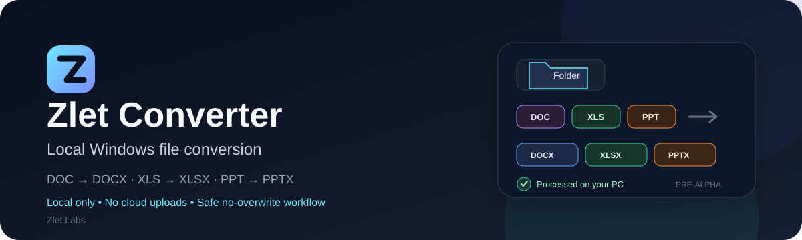

# Zlet Converter

<p align="center">
  
</p>

<p align="center">
  <strong>English</strong> · <a href="README_RU.md">Русский</a>
</p>

<p align="center">
  
  
  
  
  
</p>

Zlet Converter is a small local Windows utility for batch-processing files in folders and subfolders. It converts supported legacy Microsoft Office files, safely copies already-modern Office files, preserves relative folder structure, and keeps document processing on your computer.

> **v0.0.2 is PRE-ALPHA.** The installer is currently unsigned, so Windows may show an Unknown publisher or SmartScreen warning. Microsoft Office is not included.

> **Rename note:** the current public v0.0.2 release was published under the previous public name `Zlet Batch Converter`. Its existing release title, executable, installer, portable ZIP, and asset filenames remain unchanged as historical artifacts. Builds after ZL-057 use `Zlet Converter` / `ZletConverter` naming.

## Download v0.0.2

| Windows installer | Portable ZIP |
|---|---|
| **[⬇ Download installer](https://github.com/zlet-labs/zlet-converter/releases/download/v0.0.2/ZletBatchConverter-v0.0.2-Setup-win-x64.exe)** | **[📦 Download portable](https://github.com/zlet-labs/zlet-converter/releases/download/v0.0.2/ZletBatchConverter-v0.0.2-win-x64.zip)** |
| `ZletBatchConverter-v0.0.2-Setup-win-x64.exe` | `ZletBatchConverter-v0.0.2-win-x64.zip` |

[Release notes](https://github.com/zlet-labs/zlet-converter/releases/tag/v0.0.2) · [SHA-256 checksums](https://github.com/zlet-labs/zlet-converter/releases/download/v0.0.2/SHA256SUMS.txt)

### Why use it?

| 🔒 Local | ⚡ Batch | 🛡 Defensive |
|---|---|---|
| No accounts, no cloud uploads | Scan folders and subfolders in one run | Existing outputs are not silently overwritten |
| Document contents stay on your PC | Select only the operations you want | Office processes are never killed by name alone |

## Gemini Notebook and modern document workflows

Preparing older document collections for **Gemini Notebook** is one practical use case for Zlet Converter. Google currently lists DOCX, PPTX, TXT and Markdown among supported Gemini Notebook source types, so the converter can help prepare:

- `.doc` → `.docx`
- `.ppt` → `.pptx`
- `.json` → `.txt` or `.md`
- already-modern `.docx` and `.pptx` files as unchanged safe copies

Gemini Notebook source support: [Google Help](https://support.google.com/gemininotebook/answer/16215270?co=GENIE.Platform%3DDesktop&hl=en)

**There is no Gemini Notebook integration or automatic upload.** Zlet Converter processes files locally; you decide if and when to upload the resulting files to Gemini Notebook or another service.

## Supported formats

| Source | Result | Requirement |
|---|---|---|
| `.doc` | `.docx` | Microsoft Word installed |
| `.xls` | `.xlsx` | Microsoft Excel installed |
| `.ppt` | `.pptx` | Microsoft PowerPoint installed |
| `.docx`, `.xlsx`, `.pptx` | unchanged safe copy | Office not required |
| `.json` | `.txt` or `.md` | Office not required |

Word, Excel, and PowerPoint are detected independently. If one Office application is missing, only the corresponding legacy conversion becomes unavailable; the rest of the batch can still run.

> **PowerPoint safety:** PPT conversion is refused while user PowerPoint is already running. This avoids interfering with an open presentation. DOC/XLS conversion and unchanged PPTX copying remain available.

## Quick start

1. Download the installer or portable ZIP above.
2. For the current public v0.0.2 package, run `ZletBatchConverter.exe`. Builds produced after ZL-057 use `ZletConverter.exe`.
3. Choose a source folder and scan it.
4. Review Preview and select the operations you want.
5. Choose the output location/mode and start processing.
6. Review per-file results and the final batch summary.

Packaged builds are self-contained for .NET 8, so the .NET runtime does not need to be installed separately.

## What you get

- Preview before processing.
- Selection of individual operations before execution.
- Relative subfolder structure preserved in output.
- Per-file status, stage progress, source size, and execution time.
- Safe Stop that prevents new queued operations from starting.
- Conversion list copy using relative paths only.
- Separate final counters for converted, copied, failed, conflict, unavailable, skipped, and unselected items.
- Safer multi-file Office processing through reusable worker/session handling where appropriate.

## Limitations

Zlet Converter is still **PRE-ALPHA**. Complex, corrupted, password-protected, or unsupported legacy documents may fail to convert. Conversion fidelity depends on the installed Microsoft Office version and document features.

Original files are not intentionally modified, but keep backups of important data when testing pre-release software.

<details>
<summary><strong>Safety and privacy details</strong></summary>

The converter is intentionally local-first and defensive around user files.

- Files are processed locally and are not uploaded.
- The UI process does not perform Office COM automation directly.
- Office conversion runs through an isolated STA worker process.
- Legacy files are opened read-only.
- Macros, dialogs, and Recent/MRU additions are disabled for worker-controlled Office sessions.
- Source files must remain inside the selected source folder.
- Reparse-point files and folders are skipped.
- Source SHA-256 is checked before and after processing.
- Outputs are produced in temporary/staging locations and validated before the final move.
- Existing output files/directories are not overwritten.
- Office processes are never terminated by process name alone.
- Forced cleanup is allowed only for an app-owned process whose PID and start time were proven.
- Failure of one file does not automatically stop the remaining selected files.

Technical diagnostics may contain error codes and process metadata. They must not contain document contents, secrets, or full local document paths.

</details>

<details>
<summary><strong>Build from source and package locally</strong></summary>

Requirements:

- Windows x64
- .NET 8 SDK

```powershell
dotnet restore FolderConverter.sln
dotnet build FolderConverter.sln -c Release
dotnet test FolderConverter.sln -c Release
```

If you cloned the repository before it was renamed to `zlet-converter`, update the existing remote instead of recloning:

```powershell
git remote set-url origin https://github.com/zlet-labs/zlet-converter.git
```

Build the portable package:

```powershell
.\scripts\publish-portable.ps1
```

Expected local ZIP at the current source version:

```text
artifacts/portable/win-x64/ZletConverter-v0.0.2-win-x64.zip
```

Build the Windows installer with Inno Setup 6:

```powershell
.\scripts\build-installer.ps1
```

The installer script first builds the portable payload, then creates the Windows x64 installer and prints its SHA-256 and Authenticode status.

</details>

<details>
<summary><strong>Real Microsoft Office integration tests</strong></summary>

Real Office integration tests are opt-in because they require installed Microsoft Office and real legacy fixtures:

```powershell
$env:ZLET_OFFICE_INTEGRATION = "1"
$env:ZLET_OFFICE_WORD_FIXTURE = "C:\fixtures\sample.doc"
$env:ZLET_OFFICE_WORD_BATCH_FIXTURE_DIR = "C:\fixtures\word-batch"
$env:ZLET_OFFICE_EXCEL_FIXTURE = "C:\fixtures\sample.xls"
$env:ZLET_OFFICE_POWERPOINT_FIXTURE = "C:\fixtures\sample.ppt"
dotnet test FolderConverter.sln -c Release --filter Category=OfficeIntegration
```

If an Office application or required fixture is missing, the corresponding integration test is skipped rather than counted as passed.

</details>

## Project

Zlet Converter is a **Zlet Labs** project: small, practical, self-serve tools without unnecessary SaaS machinery.

[Zlet Labs](https://zlet.app/) · [GitHub Issues](https://github.com/zlet-labs/zlet-converter/issues) · [All releases](https://github.com/zlet-labs/zlet-converter/releases) · [MIT License](LICENSE)

Manual release verification checklist: [docs/manual-clean-machine-verification.md](docs/manual-clean-machine-verification.md)
